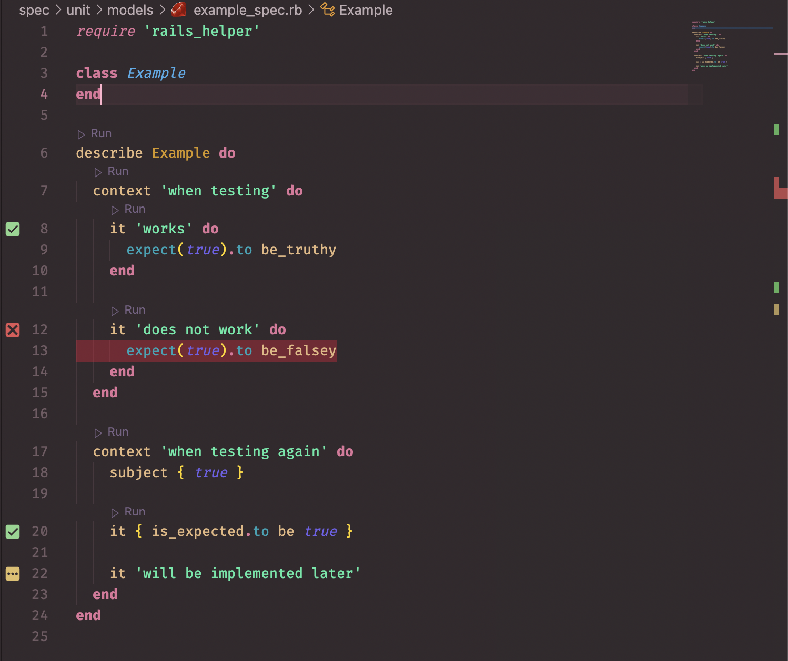

# Ruby spec runner

Run ruby rspec and minitests from vscode.

This extension is very heavily inspired by the [vscode-jest-runner](https://marketplace.visualstudio.com/items?itemName=firsttris.vscode-jest-runner) and [ruby-test-runner](https://marketplace.visualstudio.com/items?itemName=MateuszDrewniak.ruby-test-runner) extensions. ruby-test-runner didn't quite meet my needs to I decided to try and build my own version. `¯\_(ツ)_/¯`

## Features

- Run prompts next to contexts and examples in rspec allows you to run single test or group of tests within the test file
- A "run spec" button in the status bar to quickly run the test file
- `Ctrl+Alt+/` (mac: `Ctrl+Cmd+/`) will also run tests for the current file
- Tests are run inside a terminal in vscode
- Decorates the editor with the test results
- Supports Rspec (and minitest to a lesser extent)

## Extension Settings

This extension contributes the following settings:

- `ruby-spec-runner.rspecCommand`: Override the rspec command
- `ruby-spec-runner.minitestCommand`: Override the minitest command
- `ruby-spec-runner.changeDirectoryToWorkspaceRoot`: When true the test command will cd to workspace root first
- `ruby-spec-runner.projectPath`: Override the root project path
- `ruby-spec-runner.rspecFormat`: Configure rspec's terminal output format
- `ruby-spec-runner.saveBeforeRunning`: When true the test file is saved before it is run
- `ruby-spec-runner.rspecRunButton`: Show a run button in the status bar
- `ruby-spec-runner.rspecRunAllFailedButton`: Show a button to re-run failed tests in the status bar (disabled by default)
- `ruby-spec-runner.minitestRunButton`: Show a run button in the status bar
- `ruby-spec-runner.rspecCodeLensPrompts`: Show prompts in the editor to run an rspec test
- `ruby-spec-runner.minitestCodeLensPrompts`: Show prompts in the editor to run a minitest test
- `ruby-spec-runner.rspecDecorateEditorWithResults`: Show the results of rspec test runs in the editor
- `ruby-spec-runner.minitestDecorateEditorWithResults`: Show the results of minitest runs in the editor
- `ruby-spec-runner.windowsTerminalType`: For windows users that are using bash instead of powershell

## Known Issues

- I don't have access to a windows machine so I can only hope that it works there.
- Minitest support can be a bit janky as the default output isn't ideal for parsing
  - The extension can get confused when an error occurs in a setup block
- Editing a test file while tests are running may result in editor decorations appearing in the incorrect location

## Release Notes

... Are in the `changelog` tab
